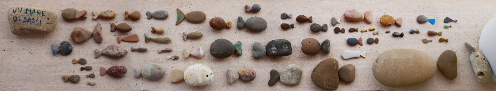

## Un mare di sassi

## Uccellacci ed uccellini

### Le galline pensierose

## Sassi consunti

## Sassi bestiali

## Sassi espressivi

## Sassi utili

## Sassi in piedi e sassi seduti

## Sassi vari
1. Sasso
2. Sassetto
3. Sasso Lino
4. Sasso comune
5. Sasso bizzarro
6. Sasso strano
7. Sasso scavato
8. Sasso forato
9. Sasso incrostato
10. Sasso perfetto
11. Sasso imperfetto
12. Sasso scollato
13. Sasso macchiato
14. Sasso spizzicato
15. Sasso giallino
16. Sasso giallastro
17. Sasso sbiadito
18. Sasso elegante
19. Sassi emergenti
20. Sasso nero
21. Sasso nerastro
22. Sassi bluastri
23. Sasso biancastro
24. Sasso a puntini
25. Sasso a dondolo
26. Sasso scorticato
27. Sasso fasciato
28. Sasso liscio
29. Sasso ripieno
30. Sasso malconcio
31. Sasso falso
32. Sasso scabroso
33. Sasso bipolare
34. Sasso rosato
35. Sasso ruvido
36. Sasso snello
37. Sasso paffuto
38. Sasso farcito
39. Sassi coi fiocchi
40. Sasso intarsiato
41. Non sasso
42. Sasso egocentrico
43. Sasso falloide
44. Sasso itifallico
45. Sasso vegetato
46. Sasso digitato
47. Sasso chissá (chissasso) (chissaccio)
48. Sasso rigato
49. Sasso donato
50. Sasso trovato
51. Sasso perduto
52. Spicchio di sasso
53. Sasso vorace
54. Sassi cardiaci
55. Sasso piatto
56. Sasso affettato
57. Sasso spezzato
58. Sasso rossastro
59. Sasso rossiccio
60. Sassi bicolore
61. Sasso diviso
62. Sasso accogliente
63. Sasso poroso
64. Sassi bottone
65. Sasso screziato
66. Sasso prezioso

### I grandi sassi
1. Sasso spaccato
2. Sasso mozzato
3. Sasso concentrico
4. Sasso lunatico

## Altri sassi

## Sassi di scorta