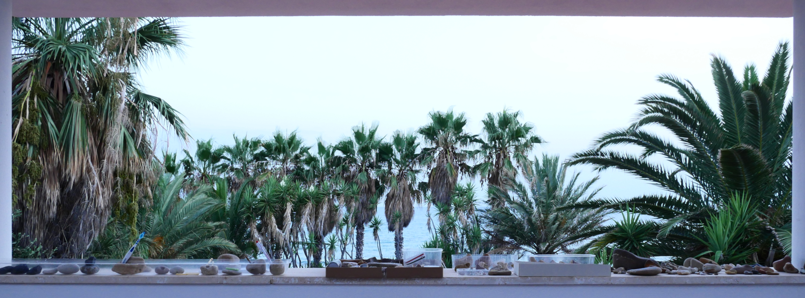

La mostra "Sasso dopo sasso" é un omaggio alla varietá geologica della baia di Capo Rossello.

Articolata in diverse sezioni, offre uno spaccato delle molteplici capacitá espressive di materiali del territorio quali calcare, marna, selce, tufo, quarzo, pomice, pietra lavica, basalto, marmo ed arenaria, caratteristici del piccolo ecosistema locale.

Nella sezione "__Un mare di sassi__" confluiscono reperti che ricordano, per forma e colorazione, la specie ittiche del Mediterraneo, dai grandi cetacei oramai estinti alla piú contemporanea sardina; una carrellata che si conclude ipotizzando uno scenario futuribile caratterizzato dalla contaminazione pesce-plastica.

Testimonianza ulteriore del forte interesse faunistico della curatrice Katia Grillo é la serie "__Uccellacci ed uccellini__", la scelta dei cui pezzi si ispira al neorealismo pasoliniano. 
Sezione piú ricca e nutrita dell'intera esposizione, ospita diversi esemplari litici di volatili domestici e selvatici.
Al suo interno, per la prima volta parte di un'esposizione aperta al pubblico, alcuni pezzi della collezione privata fanese "__Le galline pensierose__", omaggio all'omonimo testo del Malerba. 

"__Sassi consunti__" ospita invece ciottoli fluitati dall'apparente ma convincente aspetto di manufatti, spostando l'attenzione sul rapporto uomo-natura.
Di particolare interesse il fenomeno natura-cultura-natura, per cui il materiale grezzo, dopo la lavorazione, é nuovamente smussato dalla periodica azione meccanica del moto ondoso e levigato dall'azione congiunta del vento e della sabbia, riassumendo dunque la _facies_ di elemento naturale.

Adatte ad un pubblico di ogni etá le due sezioni "__Sassi bestiali__" e "__Sassi espressivi__".
La prima, una collezione di pietre zoomorfe, evidenzia la straordinaria biodiversitá del Comune di Realmonte. 
La seconda, composta da ciottoli antropomorfi, rimanda, tramite le innumerevoli espressioni facciali rappresentatevi, alle diverse sfumature dell'emotivitá umana.

Lungi dal concentrarsi esclusivamente sull'estetica del ciottolo, la mostra dá spazio anche agli aspetti pragmatici della pietra, presentando un campionario piccolo ma significativo delle forme naturali che senza alcun dubbio hanno ispirato gli esordi del design scandinavo e che continuano a dettare i canoni stilistici del colosso svedese IKEA. La sezione, intolata "__Sassi utili__", presenta sassi con una funzione specifica, estrapolandoli saggiamente dal loro contesto d'uso quotidiano.

La serie "__Sassi vari__", culminante nel gruppo "__I grandi sassi__", presenta pietre aventi ciascuna una forte individualitá, nella cui interpretazione il visitatore é volutamente lasciato libero, assolvendo cosí ad una funzione proiettivo-catartica.

L'importante sezione "__Altri sassi__" intende invece indurre il pubblico ad un atteggiamento di empatico rispetto verso ció che ad uno sguardo frettoloso puó apparire materia inerte e inamovibile. Al contrario, il gruppo "__Sassi in piedi, sassi seduti__" restituisce allo spettatore un'impressione di vivo dinamismo.

L'itinerario si conclude con una sezione interattiva, "__Sassi di scorta__", in cui al vistatore viene offerta la possibilitá di partecipare da protagonista alla catalogazione e all'inserimento in mostra di ciottoli non ancora esposti.

Con approccio nuovo ed inclusivo, la mostra propone un percorso multisensoriale. I sassi possono infatti essere non soltanto osservati, ma anche annusati, auscultati, toccati, soppesati ed eventualmente leccati.

Sono molteplici gli spunti che l'esposizione, (es)temporanea e ad ingresso gratuito, offre non solo sotto l'aspetto del godimento estetico, ma anche dal punto di vista ludico-creativo e quello scientifico, con rimandi agli ambiti della biomeccanica, della biologia, della petrologia e della vulcanologia.
